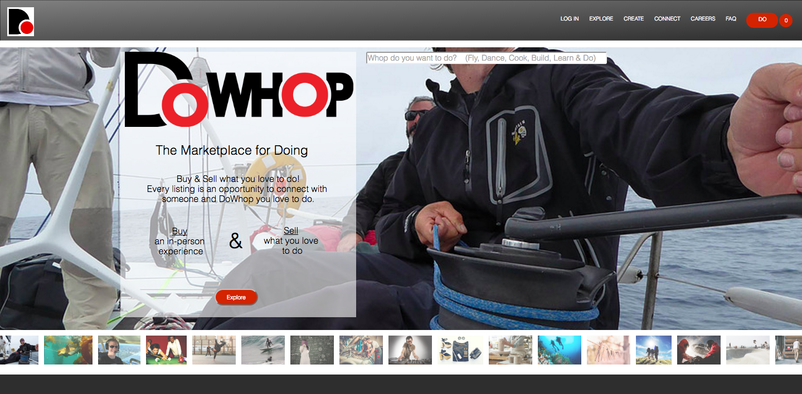

This is a mockup of an existing website (http://www.dowhop.com/) to model for a potential client who needed user login and back-end functionality on their e-commerce site. Created with a partner overnight in seven hours using Ruby on Rails. Still in talks with the client about getting the contract.

It can be viewed by cloning it to a local repo, running `bundle install`, then `rails s` to start a local server, and finally accessing it via a browser at 'localhost:3000'.

The original website can be found [here](http://www.dowhop.com/), and below is a screenshot of the mockup with user login and back-end functionality.  Events can now be created and attended by users, and are persisted to a database.

Screenshot of the mockup
